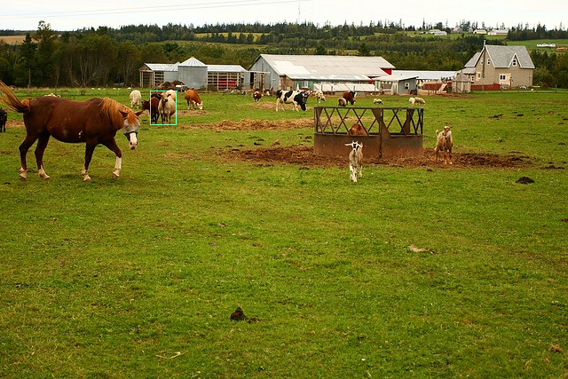

# TensorFlow Inferencing Support 

## Building

### Options

Object detection with TensorFlow could be performed with the *tfpredict* algorithm. To enable this feature you have to edit the following option

    option(BUILD_WITH_TENSORFLOW_SEGMENTATION "Build with enabled Google TensorFlow C++ support for image segmentation and enable 'tfpredict' algorithm." OFF)

and set the environment variable *TensorFlowCC_ROOT*.

### Using Docker

To build the project with TensorFlow support for inferencing and Docker, you have to create a new Docker development image as follows:

    docker build -f Dockerfile.tensorflow-ubuntu-20.04 -t cv-playground/tensorflow-dev:1.0 .

After the Docker images is created, create and execute a Docker container with

    docker run -v /home/user/cv-playground:/usr/src/cv-playground --rm -it cv-playground/tensorflow-dev:1.0 /bin/bash

and create a new build directory where you have to execute CMake like this:

    cmake .. -DBUILD_WITH_TENSORFLOW_SEGMENTATION=ON -DTensorFlowCC_ROOT=/opt/tensorflow/lib

## Usage

### Step 1: Get a pre-trained model and determine inputs and outputs

Get a pre-trained TensorFlow model in SavedModel format and with _unsigned integer 8-bit_ images as input layer. Models that need floating point input images will be supported in the future. To determine the inputs and outputs use TensorFlows *saved_model_cli* utility program.

Using the pre-trained model [SSD Mobilenet V2 Object detection model, trained on COCO 2017 dataset](https://tfhub.dev/tensorflow/ssd_mobilenet_v2/2) from [TensorFlow Hub](https://www.tensorflow.org/hub) and *saved_model_cli* you got the following output:

    MetaGraphDef with tag-set: 'serve' contains the following SignatureDefs:
    
    signature_def['__saved_model_init_op']:
      The given SavedModel SignatureDef contains the following input(s):
      The given SavedModel SignatureDef contains the following output(s):
        outputs['__saved_model_init_op'] tensor_info:
            dtype: DT_INVALID
            shape: unknown_rank
            name: NoOp
      Method name is: 
    
    signature_def['serving_default']:
      The given SavedModel SignatureDef contains the following input(s):
        inputs['input_tensor'] tensor_info:
            dtype: DT_UINT8
            shape: (1, -1, -1, 3)
            name: serving_default_input_tensor:0
      The given SavedModel SignatureDef contains the following output(s):
        outputs['detection_anchor_indices'] tensor_info:
            dtype: DT_FLOAT
            shape: (1, 100)
            name: StatefulPartitionedCall:0
        outputs['detection_boxes'] tensor_info:
            dtype: DT_FLOAT
            shape: (1, 100, 4)
            name: StatefulPartitionedCall:1
        outputs['detection_classes'] tensor_info:
            dtype: DT_FLOAT
            shape: (1, 100)
            name: StatefulPartitionedCall:2
        outputs['detection_multiclass_scores'] tensor_info:
            dtype: DT_FLOAT
            shape: (1, 100, 91)
            name: StatefulPartitionedCall:3
        outputs['detection_scores'] tensor_info:
            dtype: DT_FLOAT
            shape: (1, 100)
            name: StatefulPartitionedCall:4
        outputs['num_detections'] tensor_info:
            dtype: DT_FLOAT
            shape: (1)
            name: StatefulPartitionedCall:5
        outputs['raw_detection_boxes'] tensor_info:
            dtype: DT_FLOAT
            shape: (1, 1917, 4)
            name: StatefulPartitionedCall:6
        outputs['raw_detection_scores'] tensor_info:
            dtype: DT_FLOAT
            shape: (1, 1917, 91)
            name: StatefulPartitionedCall:7
      Method name is: tensorflow/serving/predict

### Step 2: Get a labels file

The pre-trained model from step 1 only delivers class IDs for the detected objects. If you want to filter for human readable object names you have to use a label file.

A label file for the example model from step 1 could be found at the [COCO 2017 dataset](https://github.com/tensorflow/models/blob/master/research/object_detection/data/mscoco_label_map.pbtxt).

### Step 3: Write a script file to detect objects

To detect object and mark them in an image use the *tfpredict* algorithm to perform object detection and *paint_meta* to paint the data generated by *tfpredict*.

Example 'script.txt':

    var raw = input("rgb", 8)
    var animals = tfpredict(raw)
    var cows = paint_meta(animals,
                          "detection_boxes",
                          "rectangle",
                          "#10ffA0",
                          "detection_classes",
                          "cow",
                          "detection_scores",
                          60)
    var combined = or(raw, cows)

### Step 4: Execute cvpg-imageproc

Execute the _cvpg-imageproc_ example application with the detection scriptfile 'script.txt' from step 3 on an image.

As an example the following image depicts animals and was taken from the COCO dataset (ID=494579).

Because 'cvpg-imageproc' only supports PNG images at moment the test image was converted from JPEG into PNG format and executed with the following parameters:

    ./cvpg-imageproc --input 5037182180_857ff00dc0_z.png
                     --script script.txt
                     --tfmodel ssd_mobilenet_v2_2
                     --tfinput serving_default_input_tensor:0
                     --tfoutputs "StatefulPartitionedCall:1,StatefulPartitionedCall:2,StatefulPartitionedCall:4"
                     --tflabels mscoco_label_map.pbtxt
                     --timeout 1000

The result of this command based on 'script.txt' leads to the following output image:

